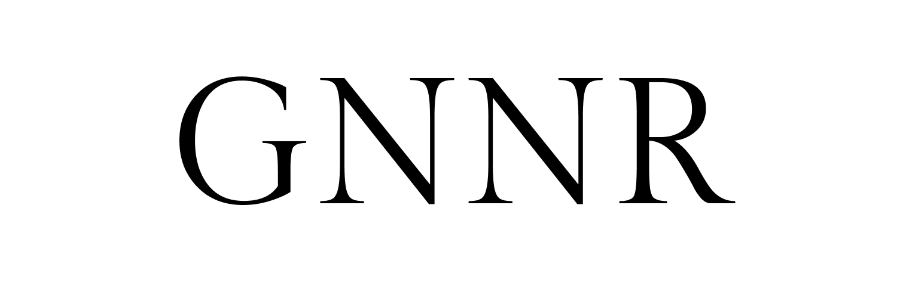

  

# 👋  Hello

My name is Gunnar. I’m a full stack web developer. I’m passionate about what I do because the internet to me symbolizes the collective potential of humankind to create spaces of freedom, beauty, and interconnection. Open-source code, free downloadable textbooks, live streaming debates, and interactive VR communities, are just some of the amazing web-enabled tools and experiences that didn’t even exist for previous generations. I'm grateful for the opportunity to contribute to a global community weaving the next generation of this digital frontier where new possibilities emerge daily.

  

    
    
    
    

    
    
    
    

